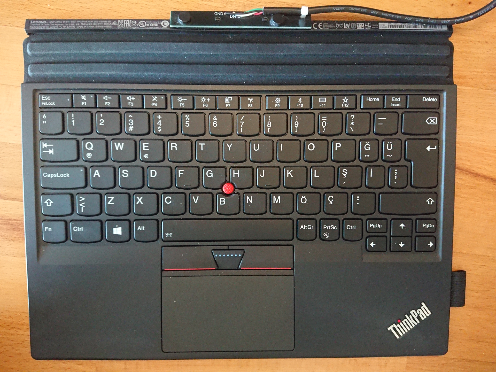

# X1 Tablet Thin Keyboard (gen1 / gen2)

A USB keyboard with a connector built-in to the hinge.



## Adaptor for use as a normal USB keyboard

The PCB can attach over the tablet's mounting posts, connecting with the pogo pins, breaking these out ready for a USB cable to be attached.

The gerbers can be found in [Gerber_tp-x1t-gen1-adapter.zip](https://github.com/lentinj/tp-compact-keyboard/raw/master/x1-tablet-keyboard/Gerber_tp-x1t-gen1-adapter.zip), which can be uploaded to JLPCB to manufacture more.

Magnets can be superglued to the PCB to hold it on, I used 8mm diameter magnets off Amazon. Hold the PCB in place on the keyboard, and they will naturally find the corresponding magnet in the connector.

Then, solder a USB cable to the pins. The colour scheme *should* (but may not) be:

* GND: Black
* DN: White
* DP: Green
* 5v: Red

This is my first attempt at designing a PCB, and it probably shows.

* The holes are fractionally too tight, and need a slight amount of filing to fit
* The hole closest to 5v should be ~1mm closer to the 5v pin, again, filing solves this

You could extend this further by designing a USB socket onto the PCB, but what I've got is fine for me at this stage.

### Other adaptors

This isn't the first attempt at attaching a regular USB cable to a X1 tablet, however IMO this is the quickest to replicate.

* https://www.reddit.com/r/thinkpad/comments/10klmxv/pinout_of_thinkpad_x1_tablet_gen1_keyboard/?rdt=51762
* https://www.reddit.com/r/thinkpad/comments/10gneh1/diy_a_usb_thinkpad_keyboard_with_backlit_and/
* https://spawn.link/posts/2019-02-18_-_lenovo_x1_tablet_keyboard/

## Slow trackpoint on gen2 keyboards

The trackpoint sensitivity for gen2 keyboards is currently far lower than libinput sensivity can adjust. The reason behind this libinput doesn't know it's a trackpoint. This can be worked around with the following in ``/etc/udev/hwdb.d/90-thinkpad-x1-tablet-keyboard.hwdb``:

```
# Lenovo "PRIMAX ThinkPad X1 Tablet Thin Keyboard Gen 2"
id-input:modalias:input:b0003v17EFp60A3e0111-e0,1,2,4,*
 ID_INPUT_POINTINGSTICK=1
```

This isn't a problem for gen1, since the hid-rmi driver it uses exposes a full PS/2 port which the trackpoint driver attaches to. In gen2, hid-multitouch receives a combined HID report, with both trackpad & touchpoint events.

The real solution is probably to register all mice applications as trackpoints [in hid-multitouch](https://github.com/torvalds/linux/blob/de2f378f2b771b39594c04695feee86476743a69/drivers/hid/hid-multitouch.c#L1653) (aside: This says hid core will add a prefix, but it won't because [that needs HID_QUIRK_INPUT_PER_APP](https://github.com/torvalds/linux/blob/de2f378f2b771b39594c04695feee86476743a69/drivers/hid/hid-input.c#L2006), which MT_CLS_WIN_8_FORCE_MULTI_INPUT turns off). Generally, [this quirk is used to register trackpoint devices](https://github.com/torvalds/linux/commit/4a6a4c966ccf38b2d74c05bb7c7dd3b94dbb3c30)
